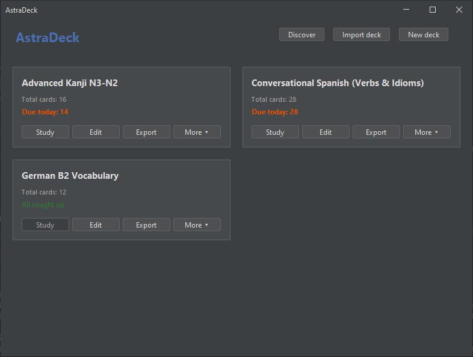
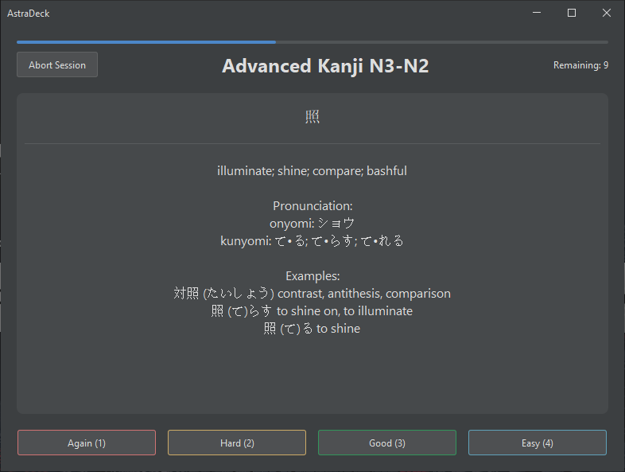
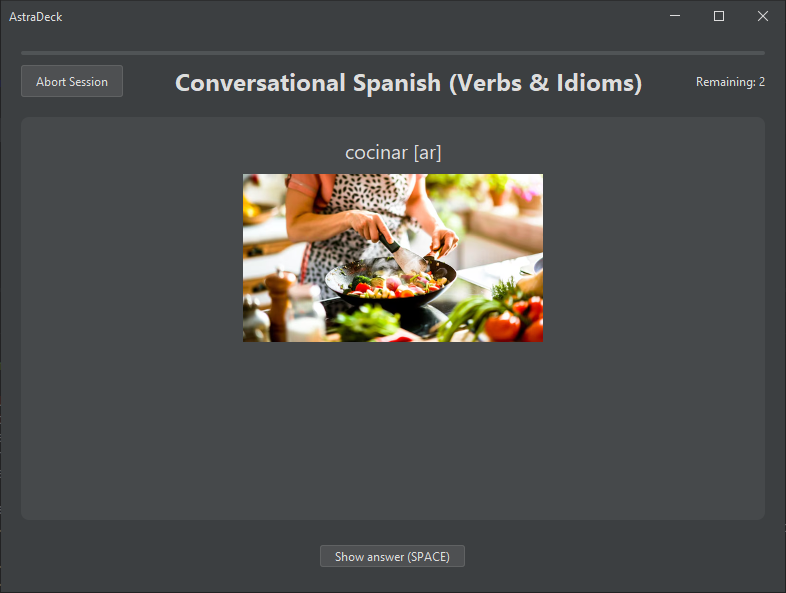
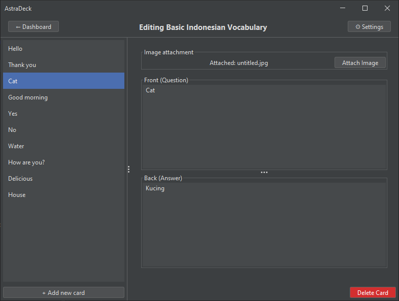

# AstraDeck

AstraDeck is a desktop flashcard application built in Java. It utilizes a spaced repetition system to optimize learning and memory retention, providing a complete environment for creating, managing, and studying flashcard decks.

## Features

* **Spaced Repetition:** Implements the SM-2 review algorithm to schedule card reviews efficiently based on user recall.
* **Deck Management:** Create, edit, and organize flashcards into discrete decks.
* **Reliable Storage:** Autosaves user progress and deck data using a local SQLite database.
* **.astra Deck Format:** Supports importing and exporting decks using a proprietary file type, which operates as a structured archive containing deck data.
* **Discovery Page:** Browse and download new flashcard decks from an integrated deck store directly within the application.
* **Extensible Card System:** Currently supports Text Cards and Image Cards, with a foundation built to accommodate new card types in future updates.
* **Modern Interface:** A clean, responsive desktop interface designed with modern themes for a focused studying experience.

## Application Views

The application is structured around three primary interfaces:
* **Dashboard:** The main landing page for navigating decks.

* **Study Session:** The core interface for studying flashcards.


* **Editor:** A comprehensive editing tool for creating new decks.


## How to install
- Ensure you have Java 25 and Maven installed on your system.
1. **Clone the repository**
    ```bash
    git clone https://github.com/wolfycz1/AstraDeck
    cd AstraDeck
    ```
2. **Build and run the application**
    ```bash
    mvn compile exec:exec
    ```
3. Done

## Technology Stack
### Core Runtime & Build
* **Language:** Java 25
* **Build System:** Maven

### User Interface
* **GUI Framework:** Java Swing
* **Theming:** FlatLaf & FlatLaf Extras (Modern cross-platform look-and-feel)
* **Media Handling:** Imgscalr (Fast, hardware-accelerated image scaling)

### Database & Storage
* **Database Engine:** SQLite (Embedded local database)
* **Data Access:** JDBI 3 (SQL mapping, Jackson2 JSON integration)
* **Schema Management:** Flyway (Automated database migrations/versioning)
* **dev.dirs** (Standard OS-specific directory resolution tool)

### Architecture & Utilities
* **Eventing & Utilities:** Google Guava (Core components like `EventBus`)
* **Serialization:** Jackson (JSON parsing, data-binding, and JSR-310 date support)
* **I/O Operations:** Apache Commons IO
* **Boilerplate Reduction:** Lombok

### Logging & Testing
* **Logging API:** SLF4J
* **Logging Implementation:** Logback Classic